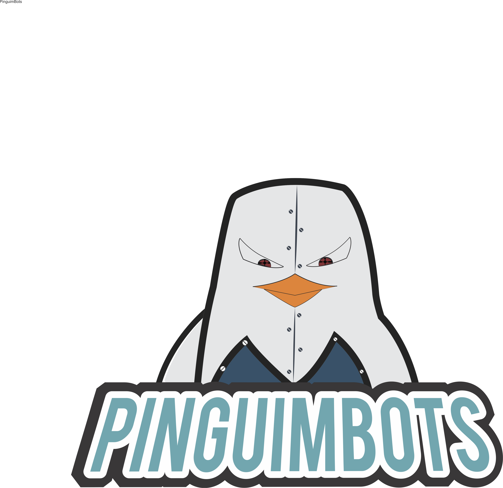
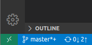
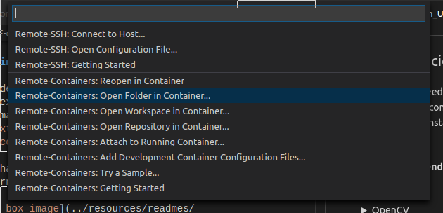

<h1 align="center">

Pinguimbots - VSSS
</h1>

<a href="#running-the-project">Running the project</a>
    •
<a href="#dependencies">Dependencies</a>

---

## Dependencies

This project needs __at least__ [Meson](https://mesonbuild.com/) 0.48,
[OpenCV](https://opencv.org/) 4.2.0, [Qt](https://qt.io) 5.9 and a C++17
capable compiler. However, you can also [use a container](#using-a-container)
with the dependencies installed instead of installing them system-wide
if you so choose.

#### Installing dependencies

Meson

Make sure you have python3 and pip installed then:

    $ python3 -m pip install meson

OpenCV

Install the dependencies:

    $ sudo apt-get install build-essential cmake git libgtk2.0-dev
    pkg-config libavcodec-dev libavformat-dev libswscale-dev python-dev
    python-numpy libjpeg-dev libpng-dev libtiff-dev libdc1394-22-dev

Download the latest version of the OpenCV4 source from their
[releases page](https://opencv.org/releases/), extract and then install using:

    $ mkdir build && cd build && cmake .. && make -j4 && sudo make install

Qt

Download the installer at the [download page](https://www.qt.io/download-qt-installer)
and follow the instructions. As of 2020 you'll unfortunately also need a
[Qt account](https://login.qt.io/register).

You can also [build it yourself](https://doc.qt.io/qt-5/build-sources.html).

#### Using a container

In vscode, install the `Remote - Containers` vscode extention from the
extensions tab or open the command pallette with `Ctrl + Shift + P` and type
`ext install ms-vscode-remote.remote-containers`.

After that, click the new green box at the bottom left corner:

Select `Remote-Containers: Open folder in container...`:

Navigate to this folder, open it and you're done!

> *Note*: You may need to run `$ xhost +local:docker` on the host machine
> to share the host's x11 to docker.

> *Note*: The extention may not work if you are using vscodium instead of vscode.

## Running the project

Firstly, setup the build system with:

    $ meson build

This will create all the build files in the folder `build`, from then on just
build with ninja and run the executable with:

    $ ninja -C build && ./build/vsss
